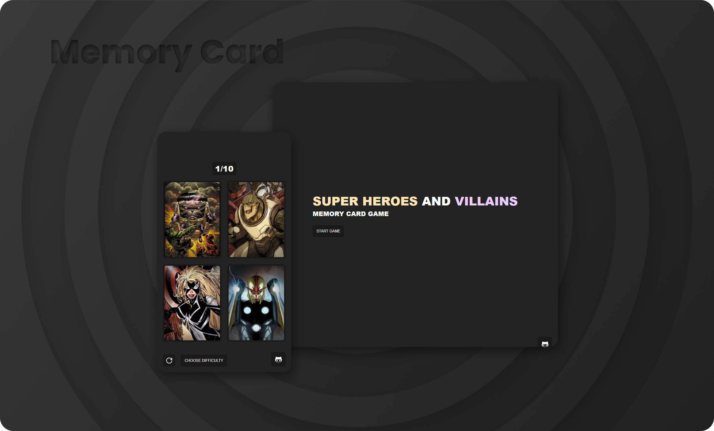
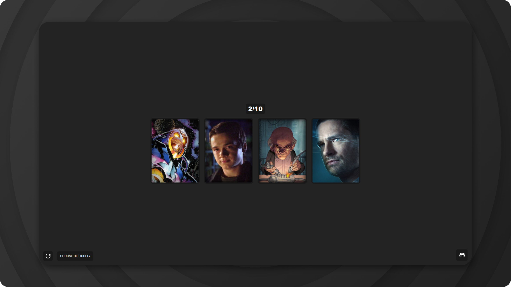

#

<h1 align="center">Memory Card</h1>

  Memory Card for <a href="https://www.theodinproject.com/">The Odin Project</a>

## Demo

👁️ [Live Demo](https://apheiro.github.io/memory_card/)

## Built with

- React
- Typescript
- [framer motion](https://www.framer.com/motion/)
- [react-icons](https://react-icons.github.io/react-icons/)
- [react-loader-spinner](https://mhnpd.github.io/react-loader-spinner/)

## Features

- Responsive design.
- Clean desing.
- _Smooth_ animations.

## Screenshots

